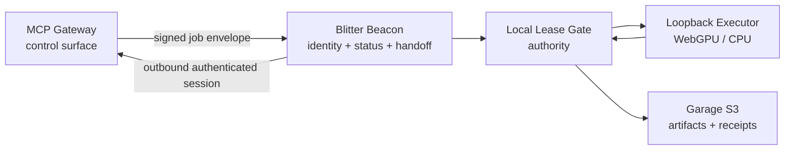

# Blitter Beacon V1

**Status:** proposed minimal-surface design.

Blitter is a worker-side beacon for the MCP Gateway. It is not a second MCP
server, a public scheduler, or an independently authoritative control plane.
The gateway owns control; the beacon supplies presence, capability evidence, and
a narrow execution handoff.

This document supersedes the application-level mesh as the V1 deployment model.
The Internet layer is the substrate: IP reachability, routing, congestion
control, and failure are handled below Blitter. Blitter must not recreate those
functions with UDP broadcast, gossip flooding, or hop-by-hop application
routing.

Prior design work remains useful as input, but is layered explicitly:

- `COMPUTE_SLOT_FABRIC_OVERVIEW_V0.md`: inventory/presence/lease separation and slot semantics.
- `COMPUTE_SLOT_FABRIC_OPERATIONS_V0.md`: operational fail-closed checks and rollout rules.
- `NODE_PRESENCE_IDENTITY_V0.md`: boot-scoped identity and expiring presence.
- `CONTROLLED_SPAWN_SEMANTICS_V0.md`: control, surface, and capability separation.
- `BLITTER_LEASE_FENCING_V1.md`: destination-side ownership and commit fencing.
- `P2P_GOSSIP_PROTOCOL_V0.md` and `COMPUTE_SLOT_FABRIC_P2P_V0.md`: exploratory mesh behavior, deferred from Beacon V1.

## 1. Boundary



The beacon has only these responsibilities:

- establish its node identity;
- open an authenticated session to the MCP Gateway;
- publish signed, bounded status and capability evidence;
- accept gateway-issued job envelopes;
- acquire or validate a local lease;
- invoke the loopback executor;
- return a signed execution receipt.

The beacon does **not**:

- expose an MCP tool surface;
- accept arbitrary peer-to-peer compute requests;
- discover or route other nodes;
- grant leases for another node;
- write arbitrary files or mount shared writable storage;
- decide whether a result is mathematically authoritative.

## 2. Minimal Threat Model

Assume the following:

- Any other tailnet member may be compromised.
- Network traffic may be replayed, reordered, or modified.
- A beacon may be faulty or compromised.
- Gossip and telemetry may be false or stale.
- The MCP Gateway may issue malformed or unauthorized work due to a bug.
- The local executor may return incorrect output.

Protect these assets:

- beacon identity and generation;
- gateway-to-beacon job authorization;
- local lease tokens and epochs;
- input/output artifacts and receipts;
- the host filesystem and kernel;
- the gateway's control surface.

The minimum security invariants are:

1. Only the gateway can authorize a job for a beacon.
2. Only the local lease gate can authorize execution.
3. The executor is unreachable from the network.
4. A result cannot become authoritative without independent verification.
5. A stale, replayed, or malformed message fails closed.
6. A beacon that cannot prove readiness is absent, not degraded into unsafe mode.

## 3. Layer Model

```text
L3  Internet layer       IP / Tailscale addressing and routing
L4  Transport             TCP or QUIC, connection lifecycle and backpressure
L5  Secure transport      TLS/mTLS, node and gateway authentication
L7  Beacon protocol       registration, status, job envelope, receipt
L7  Execution protocol    local lease gate -> loopback executor
```

Each layer has one job:

- L3 decides whether an address is reachable.
- L4 carries ordered or explicitly datagram-oriented bytes.
- TLS/mTLS authenticates the session and protects its contents.
- The beacon protocol describes the worker and its bounded operations.
- The lease gate decides whether one local execution may commit.

Application messages must not contain a second network path, relay path, or
authority model. A `node_id` identifies a participant; it is not an IP route.

## 4. Transport

V1 uses one authenticated control relationship over the Internet layer. The
preferred shape is a long-lived outbound HTTPS/HTTP2 or QUIC stream from the
beacon to the MCP Gateway. If a stream is unavailable, the beacon may use
authenticated polling.

There is no UDP broadcast and no unauthenticated listener.

The transport provides:

- Tailscale reachability as network containment;
- mTLS or an equivalent gateway-verified node credential;
- monotonically increasing message sequence numbers;
- request IDs and replay windows;
- bounded message sizes and rate limits.

Tailscale membership is a network prerequisite, not the sole application-level
authorization decision.

The gateway registry is the only V1 discovery mechanism. It learns that a
beacon exists from registration and heartbeat messages over an authenticated
session. It does not need a peer table replicated by every worker.

## 5. Beacon Lifecycle

```text
BOOT
  -> IDENTITY_READY
  -> NETWORK_READY
  -> EXECUTOR_PROBED
  -> STORAGE_PROBED
  -> REGISTERING
  -> ADMITTED
  -> READY
```

Any failed check transitions to `NOT_ADMITTED`:

```text
NOT_ADMITTED:
  no job endpoint
  no capability advertisement
  no compute acceptance
  diagnostics only
```

Admission requires:

- persistent identity loaded;
- current generation and artifact digest known;
- gateway authentication established;
- executor protocol and capability probe passed;
- local lease gate available;
- Garage read/write/readback probe passed when durable results are required.

## 6. Registration Record

The beacon sends a canonical, signed record. The signature covers every field:

```json
{
  "version": 1,
  "type": "beacon.register",
  "node_id": "...",
  "instance_id": "...",
  "generation": "...",
  "artifact_digest": "sha256:...",
  "executor": {
    "protocol": "blitter-executor.v1",
    "capabilities": ["laurent-product-v1", "exact-i32"],
    "surfaces": ["webgpu"],
    "limits": {"max_terms": 8, "max_concurrent": 1}
  },
  "load": {"active": 0, "queued": 0},
  "expires_at": "...",
  "sequence": 1,
  "signature": "..."
}
```

The gateway treats the record as evidence. It must still re-probe the beacon
before dispatching work and must never infer authority from registration.

## 7. Job Handoff

The MCP Gateway sends a signed envelope containing:

```text
job_id
input_object_digest
operation
required_capabilities
resource_limits
lease_ttl
deadline
gateway_request_id
```

The beacon verifies:

- gateway identity and signature;
- freshness and sequence number;
- job digest and schema;
- capability and input limits;
- local policy and admission state.

It then asks the local lease gate to acquire the job. The executor receives only
the validated job and a local execution context over loopback. It never receives
network credentials or gateway control tokens.

The result path is:

```text
executor result
  -> lease gate commit check
  -> content-addressed output
  -> signed execution receipt
  -> independent verifier
  -> gateway promotion
```

## 8. What Emergence Means Here

Emergence is deliberately moved into the gateway's view of the reachable
Internet-layer population:

- the gateway may observe many beacons;
- it may rank them by capability, load, locality, and trust;
- beacons can appear, disappear, or change capacity;
- no host-wide static scheduler is required;
- IP reachability and transport recovery determine which beacons can participate.

The individual beacon remains simple and deterministic. It does not need a
global peer table or mesh routing logic in V1. Direct beacon-to-beacon routing
is explicitly deferred; if later introduced, it must remain a transport
optimization subordinate to gateway authorization and destination lease rules.

## 9. Explicitly Deferred

- UDP gossip;
- peer-to-peer passthrough;
- distributed lease consensus;
- arbitrary MCP tool execution on workers;
- shared writable NFS;
- self-updating or self-authorizing code;
- mathematical promotion by the executor alone.

This keeps the first deployable surface to one gateway relationship, one local
lease boundary, one loopback executor, and one durable receipt path.
